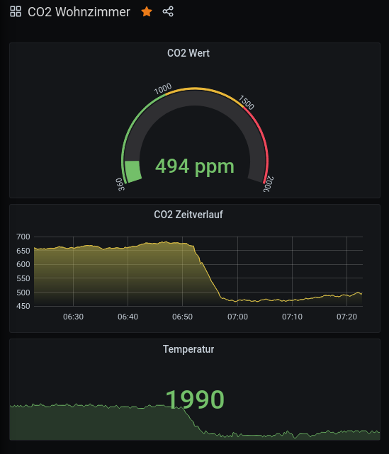

# CO2-Anzeige mit PICAXE oder Raspberry PI – kostengünstig, einfach und schnell aufzubauen.

Der Herbst ist da, und wir alle beschäftigen uns mit der Frage, wie wir uns und unseren Kindern einen möglichst sicheren Arbeits-,
Schul- und Kitabesuch über den kommenden Winter ermöglichen. Wie können wir vermeiden, uns mit dem leidigen Corona-Virus anzustecken? Neben vielen Konzepten gibt es die Empfehlung, die Räume regelmäßig zu lüften, um dadurch die Konzentration an Aerosolen, die wir nun mal unvermeidlich ständig ausatmen, zu reduzieren. Nur - wann soll gelüftet werden, pauschal alle 20min wie es aktuell die Schulen praktizieren? Das ist sicherlich für eine Schulklasse als grobe Faustregel gut, aber privat ist das übertrieben. Hier brauchen wir etwas Hilfe, eine Lüftungs-Anzeige wäre sehr wünschenswert.

Nun atmen wir ja nicht nur Aerosole, sondern insbesondere CO2 aus. In einem Raum, in dem sich eine Gruppe von Menschen aufhält und entsprechend atmet, steigt der Gehalt der Aerosole zusammen mit der CO2-Konzentration. Und letzteres lässt sich messen. Wenn sich der CO2-Gehalt von einem Normalwert von 400ppm im Raum auf etwa 1000ppm erhöht hat, gilt als Empfehlung: Fenster auf!

Für den CO2-Gehalt der Luft gibt es zahlreiche fertige Messgeräte und Sensoren, und es gibt aktuell viele Selbstbau-Vorschläge in allen Medien. Auch das [Make-Magazin](https://www.heise.de/make/) hatte in seiner letzten Ausgabe eine CO2-Ampel ausführlich vorgestellt.

An dieser Stelle möchte ich meine persönlichen Versuche für eine CO2-Anzeige dokumentieren. Zum einen möchte ich einen Vorschlag machen, welcher sehr einfach und kostengünstig aufzubauen ist. Die Bauteile sind für unter 50€ zu bekommen, und er lässt sich daheim oder zusammen mit Schülern (und Eltern) innerhalb von etwa zwei Stunden aufbauen. In meinem zweiten Aufbau probiere ich ein paar Dinge aus, die mich schon lange jucken, nämlich einen IOT-Service auf dem Raspberry-Pi, gebaut mir Java und [quarkus](https://quarkus.io/) mit Auswertung durch [Prometheus](https://prometheus.io) und [Grafana](https://grafana.com). Beide Varianten basieren auf dem kostengünstigen Sensor [MH-Z19b](https://www.winsen-sensor.com/sensors/co2-sensor/mh-z19b.html), siehe auch das [Datenblatt](doc/MH-Z19B-Datasheet.pdf).

Damit wir uns nicht missverstehen: so ein Selbstbau-Sensor kann natürlich immer nur zusätzliche Hinweise geben, wann das Lüften gerade notwendig sein könnte. Bitte verzichtete nicht auf den gesunden Menschenverstand! Wenn es mieft, dann ist die Luft verbraucht und entsprechend ist der Aerosolgehalt hoch. Wenn ihr selber merkt, dass es eine Lüftung braucht, dann öffnet bitte die Fenster.

## Einfach aufzubauende Version mit einem PICAXE im Bilderrahmen.

Die einfachste Variante verwendet einen PICAXE 08M2-Mikrocontroller mit einem Micro-Servo als Anzeige. Dieser Aufbau passt gut
hinter einen Bilderrahmen und kann somit auf Omas Anrichte neben den Fotos der Enkelkinder drapiert werden. Ebensogut macht er
sich auf einem Lehrerpult oder dem Aktenschrank im Büro.

Die Beschreibung für diesen Aufbau findet sich im Ordner [picaxe](picaxe). Der Bilderrahmen ist in etwa zwei Stunden zu bauen (wer noch nie einen PICAXE programmiert hat, braucht etwas länger), die Bauteile sind für unter 50€ zu haben.

## Die Profi-Version mit Raspberry-Pi, quarkus, prometheus und grafana - IOT pur.

Die RasPi-Version ist im Ordner [raspberry](raspberry) beschrieben. Hiermit sind nicht nur der aktuelle Wert der CO2-Konzentration auswertbar, sondern ganze Zeitreihen von diversen Parametern des Sensors MH-Z19b.

