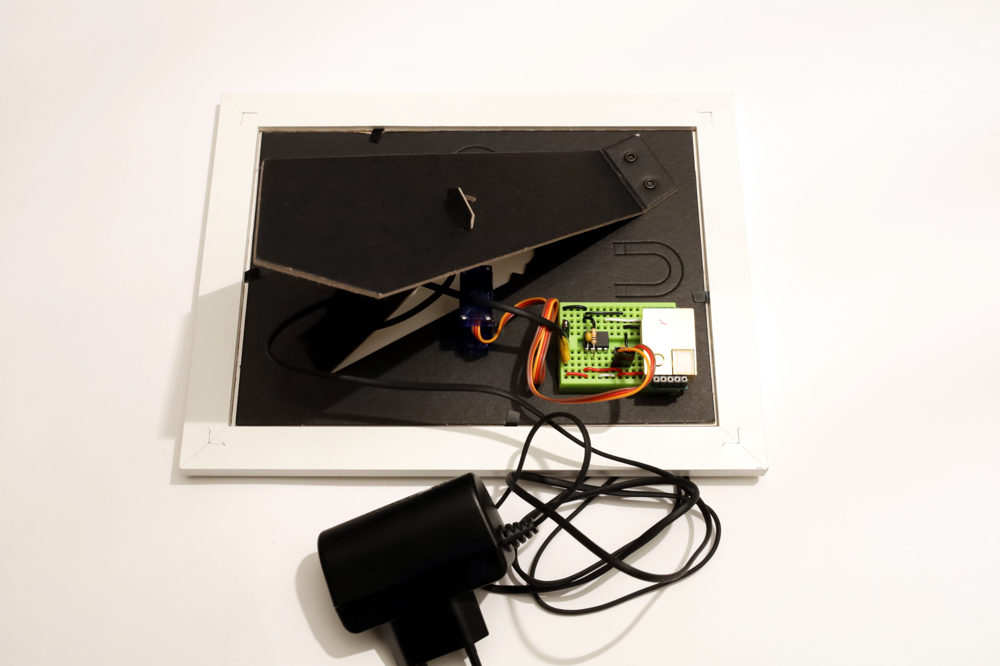

# Ein CO2-Bilderrahmen mit einem PICAXE, einfach und schnell aufzubauen

Der CO2-Bilderrahmen basiert auf dem kostengünstigen Sensor MH-Z19b sowie dem bekannten PICAXE-Mikrocontroller 08M2 (siehe ausführlich im aktuellen [MAKE-Sonderheft](https://www.heise.de/news/Sonderheft-Make-PICAXE-Special-jetzt-im-heise-shop-erhaeltlich-4889649.html)), welcher insbesondere durch Schüler einfach zu programmieren ist. Als Anzeige des CO2-Wertes verwenden wir einen kleinen Servo-Motor, der als Zeigerinstrument dient. Schließlich benötigen wir noch ein Programmiergerät für den PICAXE, entweder das Nano-Axe-Board aus dem Make-Sonderheft, oder das Pogrammierkabel vom PICAXE selbst, oder gar ein Eigenbau aus einem handelsüblichen USB-RS232-Adapter, siehe Ordner [Programmieradapter](programmieradapter). Eine Computer zur Erstellung des Programms brauchen wir natürlich auch. Lötkolben, Platinen, Widerstände, Kabel und Kleinmaterial sollten sich irgendwo in einer Bastelkiste finden lassen. Eine Stückliste ist unten zu finden.


Wie man aus dem Datenblatt des Sensors entnehmen kann, gibt der MH-Z19b seinen Messwert auf verschiedene Arten und Weisen aus. Zum einen lässt er sich über ein serielles Protokoll auslesen. Dies wird von vielen Bauvorschlägen verwendet, die sich im Internet finden lassen. Allerdings ist die Implementierung von diesem Protokoll mit etwas Programmieraufwand auf Seiten des PICAXE verbunden, der sich nicht innerhalb einer Doppelstunde realisieren lässt. Diesen Aufwand treiben wir erst bei der Version mit dem [Raspberry](../raspberry).

Die andere Auswerteart ist zwar seltener zu finden, aber unvergleichlich viel einfacher zu verwenden. Der Sensor gibt über einen PWM-Ausgang Pulse aus, deren Länge der CO2-Konzentration entspricht. Die Pulslänge muss man noch nicht mal großartig umrechnen, um den CO2-Gehalt zu bekommen.

```
    # Die Pulslänge in Millisekunden entspricht der halben CO2-Konzentration im ppm, bis auf 2ms:
          CO2(ppm)  = ( Pulslänge(ms) – 2 ms ) * 2      # ( oder * 5, je nach Sensor-Bereich )
    # Wenn man also eine Pulslänge von 442ms misst, entspricht dies einer CO2-Konzentration von 880 ppm.
```

Wir benötigen also ein Programm für den PICAXE, welches eine Pulslänge misst und diese Länge dann in einen Wert für einen Servo umrechnet. Das ist nicht schwer, und das Resultat liegt [hier](mhz19.bas). Die Details zum Programm werden unten noch weiter erläutert.

## Stückliste

Bauteil | Anzahl | Kosten | Bezugsquelle (Beispiel)
--------|--------|--------|------------------------
Bilderrahmen 13x18 | 1 | ca 5€ | Bau- oder Möbelmarkt, idealerweise mit Kunststoff als "Glas"
Sensor MH-Z19b | 1 | 20-30€ | [Berrybase](https://www.berrybase.de/neu/mh-z19b-infrarot-co2-sensor), [Reichelt](https://www.reichelt.de/infrarot-co2-sensor-mh-z19b-co2-mh-z19b-p266033.html) oder diverse Quellen mit Lieferung aus China (Achtung, lange Lieferzeit)
PICAXE 08M2 | 1 | 3,50€ | [Picaxe-Shop](http://www.picaxe-shop.de/epages/63174191.sf/secea3c825b6d/?ObjectPath=/Shops/63174191/Products/AXE007M2)
Mikro Servo | 1 | 3,50€ | [Berrybase](https://www.berrybase.de/bauelemente/elektromagnetische-bauelemente/motoren-servos/sg-92r-micro-servo)
Mini Steckboard | 1 | 0,80 € | [Berrybase](https://www.berrybase.de/raspberry-pi-co/raspberry-pi/prototyping/mini-breadboard-mit-170-kontakten)
Stiftleiste | 1 | 0,85 € | [Reichelt](https://www.reichelt.de/stiftleisten-2-54-mm-1x50-gerade-mpe-087-1-050-p119891.html)
Widerstand 10kOhm | 1 | 0,10€ | [Reichelt](https://www.reichelt.de/widerstand-kohleschicht-10-kohm-0207-250-mw-5--1-4w-10k-p1338.html)
Drahtbrücken |  | 1€ | z.B. vom Baumarkt 1m 12-adriger Klingeldraht, der aufgedröselt wird
Kondensator 100nF | 2 | 0,06€ | [Reichelt](https://www.reichelt.de/keramik-kondensator-100n-kerko-100n-p9265.html)

Zusätzlich brauchen wir ein Programmiergerät. Entweder das Nano-AXE-Board von der Make, oder aber per Selbstbau zB aus einem RS232-USB-Adapter, siehe Stückliste
[dort](programmieradapter).

Und natürlich Kleinkram wie Lötkolben, Lötzinn, 2-k-Klebstoff, Werkzeug und alles, was ich hier vergessen habe.


Aber nun zum Aufbau. Wir verwenden hier ein Steckboard, um die Lötarbeiten zu minimieren.

## Vorbereitung des Bilderrahmes

Der Bilderrahmen sollte Bilder vom Format 13x18cm fassen können. Ich verwende hier ein sehr preisgünstiges Exemplar aus einem Möbelhaus mit schwedisch klingendem Namen. Als Besonderheit ist die "Glasplatte" des Rahmens nicht wirklich aus Glas, sondern aus einem recht dünnen transparenten Plexiglas. Dadurch ist es möglich, diese Platte zu durchbohren.

Zunächst zeichnet euch eine passende CO2-Skala für den Bereich zwischen 400 und 2000ppm. Unter [../doc](../doc/CO2-Skala.pdf) liegt die Vorlage, die gerne verwendet werden kann. Die Skala wird auf die Maße des Rahmens zugeschnitten, bei mir also auf 13x18. Der Mittelpunkt der Skala ist mit einem kleinen "+" markiert, hier wird später der Zeiger vom Servo sitzen. Dieser Mittelpunkt sollte nach meiner Meinung aus optischen Gründen sowohl nach links und rechts als auch nach oben den gleichen Abstand (9cm) haben. Nach unten bleiben also 4cm Abstand zwischen Mittelpunkt und unterer Kante.

Baut die Skala in den Bilderrahmen ein, dann bohrt vorsichtig (am besten per Hand) am Mittelpunkt (+) durch Plexiglas, Skala und Rahmenrückwand ein Loch mit einem Durchmesser, so dass der Hals vom Servo dort durch passt (11mm bei mir). Der Servo ist allerdings nicht rund, sondern Birnen-förmig. Entsprechend muss das Loch noch vorsichtig ausgefeilt werden. Aber bitte vorsichtig, auch Plexiglas kann brechen. Das Resultat seht ihr hier:


Der Bilderrahmen hat hinten eine Stütze aus Pappe. Zwischen Rückwand und Stütze hat der Servo reichlich Platz. Der Motor kann dort mit etwas Klebstoff (ich nehme gerne 2-k-Kleber) fixiert werden.


Der Servo wurde vermutlich mit mehreren Aufsetzen zur Montage von Zeigern o.ä. geliefert. Wählt den Aufsatz aus, welcher schon so aussieht wie ein Zeiger. Dieser kann verlängert werden, z.B. durch einen Strohhalm und etwas 2-k-Kleber.


## Vorbereitung vom Sensor MH-Z19b

Der Sensor MH-Z19b hat ungefähr die Maße einer halben Streichholzschachtel. Er besteht aus einer Platine und einem goldenen Metallgehäuse. Links und rechts vom Gehäuse hat die Platine 4 bzw 5 Lötaugen. Auf der Seite mit den fünf Augen ist noch eine Buchsenleiste angebaut. Letztere hat zum Gehäuse eine Sollbruchstelle, erkennbar durch eine Linie feiner Punkte.


Ihr könnt (müsst aber natürlich nicht) die Sollbruchstelle mit einem Cutter-Messer von beiden Seiten anritzen und die Buchsenleiste vorsichtig abbrechen.

Die vier Lötaugen werden nun mit einer Stiftleiste versehen. Wenn ihr eine lange Stiftleiste besorgt habt, dann könnt ihr ein Teilstück von vier Stiften mit einem Drahtschneider abtrennen. Die Stiftleiste wird von unten durch die Lötaugen gesteckt, so dass die langen Stücke der Stifte nach unten zeigen.


Die fünf Lötaugen bleiben frei, sie werden hier nicht benötigt. Für die Experimente mit dem Raspberry Pi habe ich allerdings dort eine Buchsenleiste _von oben_ angelötet.

## Die Stromversorgung.

Die Anzeige soll im Dauerbetrieb über 24h laufen, siehe [Pflegeregeln](https://github.com/frifle/co2logger#pflegeregeln) für den Seinsor. Der Bilderrahmen braucht also ein Netzteil. Unser Sensor benötigt 5V mit einem laut Datenblatt Spitzenstrom von 150mA. Der Servo funktioniert bei 5V auch. Die Netzteile aus dem Fundus von alten Handy-Teilen liefern 5V bei mind. 500mA, das reicht. Ich nehme also ein solches Netzteil und baue es für den Einsatz auf dem Steckboard um.

Ich habe hier gerade ein Netzteil mit einem alten proprietären Stecker da. Den werde ich abschneiden und statt dessen ein Stück Stiftleiste montieren. Wenn ihr allerdings ein Netzteil mit USB-Stecker habt, dann würde ich mir eine Mikro-USB-Buchse besorgen und diese auf ein Stück Platine löten, siehe Vorschlag unten.

Doch nun zu meinem Stecker. Er wird abgeschnitten, die Drähte der Leitung werden getrennt und verzinnt.


Nehmt nun eine Stiftleiste mit sechs Stiften und zieht die mittleren beiden Stifte heraus. Legt die Stifte zur Seite, wir brauchen sie gleich noch. Die beiden Stiftpaare werden jeweils mit einem Draht verlötet.


Wir sind nun soweit, einen ersten Test auf dem Steckboard zu machen. Hoffentlich sind die Stiftleisten durch die Wärme des
Lötkolbens nicht zu sehr verbogen. Messt mit einem Multimeter aus, wo bei der Stromversorgung der (+)-Pol ist. Markiert ihn unbedingt, damit es nachher nicht zu Verwechselungen kommt. Die Stiftleiste der Stromversorgung kann noch mit etwas 2-k-Kleber
verstärkt werden. Insbesondere kann auf diesem Wege die (+)-Pol-Markierung gesichert werden.


Die oben angesprochene Alternative für Leute mit USB-Netzteil zeigen die folgenden zwei Bilder:


## Das Programm für den PICAXE

Das [Programm](mhz19.bas) für den PICAXE ist sehr übersichtlich, da das Basic vom PICAXE die eigentlich komplizierten Dinge zur Messung der Pulslänge oder zur Ansteuerung des Servos in schon vorgefertigte Basic-Befehle wegkapselt. Das Programm geht durch die folgenden Schritte durch:

1. Bei Start wird mit dem Servo der gesamte Anzeige-Bereich einmal zum Test durchfahren.

2. Nach einer Pause von 5s wird die Pulslänge gemessen. Da der Puls recht lang sein kann (bis ca 1s), wird der PICAXE etwas in der
Geschwindigkeit gedrosselt, um diese Länge noch zuverlässig messen zu können. Wir drosseln auf 1MHz, pausieren kurz, messen dann die Länge und geben wieder mit 4MHz Gas. Das Ergebnis der Messung liegt nun in der Word-Variable `w0`, und zwar in Einheiten von `40µs`, siehe Datenblatt vom PICAXE. Es folgt die Umrechnung im CO2-ppm, welche in der Word-Variable `w1` abgelegt werden.

In die Umrechnung für die CO2-Konzentration geht der Wertebereich des Sensors ein. Die Sensoren werden allerdings leider in verschiedenen Einstellungen ausgeliefert. Ich habe hier Exemplare mit einer Einstellung von 0-2000 und von 0-5000 ppm. Zwar kann man den Sensorbereich mit einem Kommando auf der seriellen Schnittstelle umstellen. Aber wir wollen an dieser Stelle einfach bleibem. Wir können uns die Pulslänge des vorliegenden Sensors bei Frischluft (also ca 400ppm) ja ansehen. Daraus können wir die Einstellung des Sensors ablesen und entsprechend die Umrechung im Programm wählen. Der PICAXE kennt den `debug`-Befehl, über welchen wir die Werte der Variablen sehen können..

3. Nun wird per Dreisatz von Millisekunden auf den Steuerbereich des Servos umgerechnet. Dieser ist üblicherweise irgendwo zwischen 60 und 175 (laut Datenblatt des PICAXE), bei mir geht aber mehr: Der Servo kann zwischen 45 und 225 fahren. Entsprechend rechne ich um. Das Ergebnis liegt in der Word-Variable `w2`. Der Servo benötigt das niederwertige Byte, das wäre dann `b4`.

Die Wertebereiche, die in die Dreisatzrechnung einfliessen, sind schon fertig als Konstante eingebunden und etwas gerundet, um mit Integer-Werten arbeiten zu können. Ach, und eine Besonderheit des PICAXE: Er kennt keine Punkt- vor Strichrechnung, er rechnet stumpf von links nach rechts.

4. Der berechnete Wert `b4`wird an den Servo gesendet, aber nur wenn er sich zur vorangegangenen Messung verändert hat. Den Wert
merken wir uns in `b6`. Der Servo wird nur für 1s angelassen. Diese Zeit reicht aus, um den Servo zu positionieren. Die restliche Zeit sollte er aus sein. Zum einen verbraucht er dann weniger Strom, und er nervt nicht mit ständigem Gezirpe.

5. Für die nächste Messung zurück zu 2.

Für die Programmierung vom PICAXE wird eine Software benötigt, z.B. der [Picaxe Editor](https://picaxe.com/software/) oder [Blockly](https://picaxe.com/software/). Damit kann unser Programm über das Nano-AXE-Board oder den [Programmieradapter](programmieradapter) auf den PICAXE-Mikrocontroller aufgespielt werden. Wer noch nie einen PICAXE programmiert hat, sollte sich vielleicht zunächst kurz mit einer blinkenden LED beschäftigen, siehe [MAKE-Sonderheft](https://www.heise.de/news/Sonderheft-Make-PICAXE-Special-jetzt-im-heise-shop-erhaeltlich-4889649.html).

## Aufbau auf dem Steckboard

Der PICAXE braucht zur Minimalbeschaltung eine Verbindung zu (+) an Pin 1, die Verbindung zu (GND) an Pin 8 sowie einen Pulldown-Widerstand an Pin 2. Zusätzlich hat er gerne noch einen Kondensator direkt am IC an der Stromversorgung verbaut. Vorsicht, die (+) und (GND)-Belegung ist hier ungewöhnlich: (+) ist "unten"!


Der Servo wird mit der Stromversorgung verbunden. Bei mir hat der Servo drei Kabel mit den Farben braun für (GND), rot für (+) und orange für die Steuerleitung. Die Steuerleitung wird mit Pin 3 vom PICAXE verbunden. Dieser PIN heisst im BASIC C.4. Die Stromversorgung vom Servo bekommt noch einen Kondensator spendiert.

Wie der Sensor verbunden wird steht auf der Unterseite von seiner Platine. Der Anschluss Vin kommt an (+), GND kommt an GND und PWM liefert die Pulse. Dieser Anschluss wird mit Pin 5 vom PICAXE verbunden. Er heisst im BASIC C.2

Auf dem Mini-Steckboard sieht die Verdrahtung so aus. Mit rotem Draht ist (+) verlegt, schwarz ist GND und weiss sind die Signalleitungen.


Um den Servo mit dem Steckboard zu verbinden, verwenden wir die oben übrig gebliebenen Stifte aus der Stiftleiste:


Servo, Sensor und Stromversorgung können nun auf das Steckboard gesetzt werden.


Und damit sind wir bereit für den finalen Zusammenbau. Das Steckboard wird mit etwas Klebstoff auf der Rückseite des Bilderrahmens fixiert. Das Kabel zum Netzteil wird als Zugentlastung einmal um die Stütze des Bilderrahmens geknotet. Und voila, ab gehts mit dem Bild auf die Anrichte von Oma.




## Kalibrierung vom Sensor

Die Kalibrierung des Sensors hat sich in meinen Versuchen als ein Problem heraus gestellt. Die Qualität der Sensoren, die ich in den letzten Tagen von verschiedenen Anbietern bekommen habe, scheint zu schwanken. Da ist noch Vertrauensaufbau nötig und etwas Experimentierbedarf. Dies ist also noch work-in-progress und wird die nächsten Tage ergänzt.
