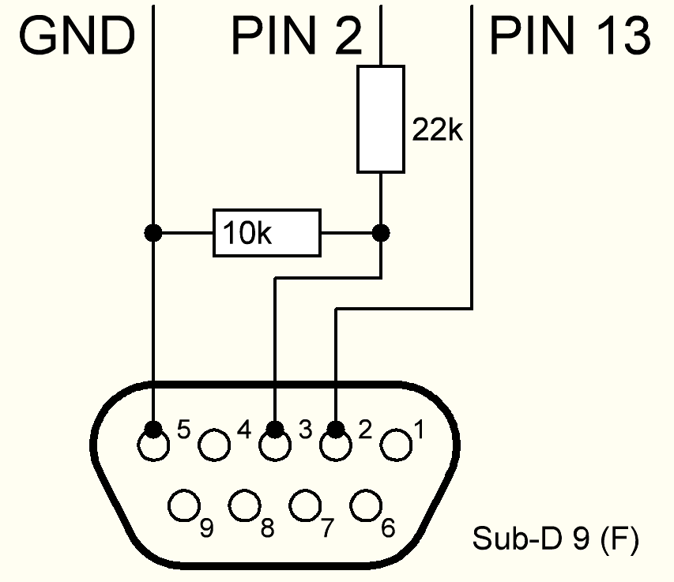
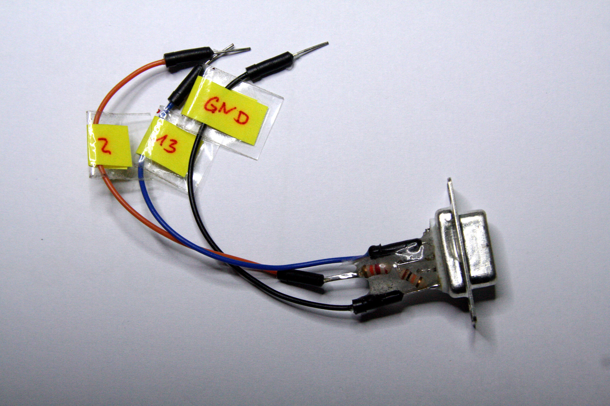

# Eigenbau eines Programmieradapters für die PICAXE-Mikrocontroller

Das Programmierkabel von Picaxe ist nach meiner Meinung recht teuer. Aber die Kollegen von Revolution Education waren so nett,
sogar in PICAXE-Manual [Nr 1, Abschnitt Serial Download Circuit](https://picaxe.com/docs/picaxe_manual1.pdf) einen Vorschlag für eine Eigenbau-Variante des Programmierkabels zu machen. Es wird dazu ein handelsüblicher RS232-USB-Adapter benötigt, der für deutlich weniger Geld (unter 10€) zu haben und vielseitiger verwendbar ist. Der Schaltplan dazu ist simple:

Hier sieht man meine eigene Version eines Programmieradapters. Es ist ein fliegender Aufbau, den ich in etwas Zweikomponenten-Kleber eingegossen hab:

